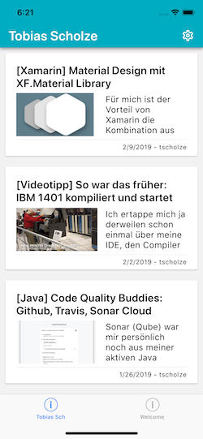
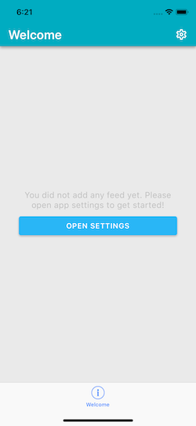

# Frettir
> A customizeable Wordpress Feed Reader writting as a Beginner project with Microsoft Xamarin

## Status
|Platform | Status|
|---|---|
|iOS| |
|Android||

The solution is work in progress and not meant to be used from other persons than me. If you are looking for a perfect example to du something. Nope, that's not here.

## Idea behind
It is never to late to learn something new. 
Thats why I want to learn Xamarin, XAML and C#. As a trick to stay focused during the learning nights, I like to create example projects that could be used as a 'trainings area'. I test primarily on iOS.

## Prerequirements
- Visual Studio 2017 *or*
- Visual Studio for Mac

## Used packages
- Xamarin.Forms ([Github](https://github.com/xamarin/Xamarin.Forms))
- Xamarin.Essentials ([Github](https://github.com/xamarin/Essentials))
- XF.Material ([Github](https://github.com/contrix09/XF-Material-Library))
- Newtonsoft.Json ([Github](https://github.com/JamesNK/Newtonsoft.Json))

(Sub packages are not listed.)

## How it looks

## Contributing

This is a time-by-time sparetime project for myself. That means, no contribution is necessary.

## Authors

Just me, [Tobi]([https://tscholze.github.io).

## License

This project is licensed under the MIT License - see the [LICENSE](LICENSE.md) file for details.
Dependencies or assets maybe licensed differently.

